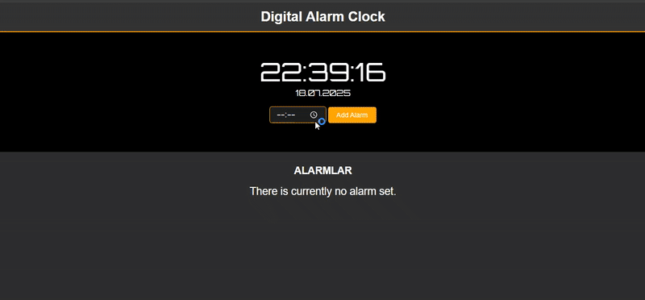

# ⏰ Digital Alarm Clock

This is a **Digital Alarm Clock Web Application** built using **HTML**, **CSS**, and **JavaScript**. It displays the current time and date in real-time, and allows users to **set multiple alarms** that trigger a sound when matched with the system time.

---

## 🖼️ Preview

 <!-- Replace this with your actual preview gif or image -->

---

## 🚀 Features

✅ **Live Clock & Date**  
The clock updates every second to reflect the real-time system time and date.

✅ **Add Alarms**  
Users can set alarms via an input form, and each alarm is listed dynamically on the page.

✅ **Audio Notification**  
When the current time matches a set alarm, a looping alarm sound is played.

✅ **Stylish UI**  
Dark-themed digital interface styled using **Orbitron** font and modern CSS.

✅ **Responsive Design**  
Works smoothly across different screen sizes with a clean layout.

---

## 🛠 Technologies Used

- **HTML5** – Page structure  
- **CSS3** – Styling and responsive layout  
- **JavaScript** – Real-time clock functionality and alarm logic  
- **Google Fonts** – For the digital clock appearance  
- **Audio File** – For alarm sound playback  

---

## 🔍 Preview

---

## 📞 Contact

📩 **Email:** [saadetnajaf@gmail.com](mailto:saadetnajaf@gmail.com)  
📷 **Instagram:** [@saadet_najaf](https://www.instagram.com/saadet_najaf)  
💼 **LinkedIn:** [Saadet Najaf](https://www.linkedin.com/in/saadetnajaf/)
